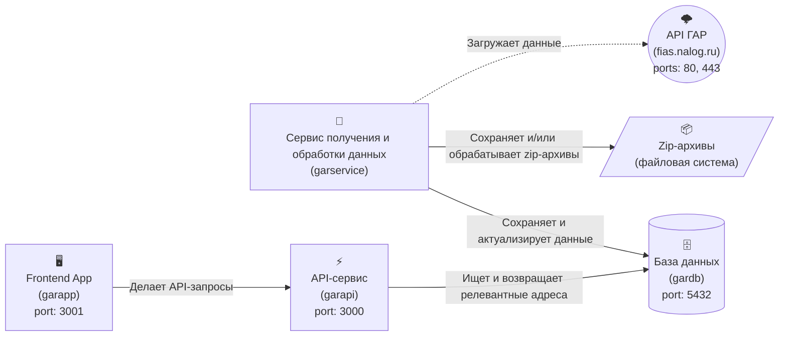

# Self-hosted API-сервис для поиска адресов России

Self-hosted API-сервис для поиска адресов России на основе данных, предоставляемых государственным адресным реестром ([ГАР](https://fias.nalog.ru)).


## 📚 Оглавление
[Рекомендуемые системные требования](#-рекомендуемые-системные-требования)  
[Установка](#-установка)  
[Сценарии использования](#-сценарии-использования)  
 [Использование сервиса в открытом контуре с доступом к сети Интернет](#-использование-сервиса-в-открытом-контуре-с-доступом-к-сети-интернет)  
 [Использование сервиса в закрытом контуре без доступа к сети Интернет](#-использование-сервиса-в-закрытом-контуре-без-доступа-к-сети-интернет)  
  [Ручная поставка дельт изменений](#-ручная-поставка-дельт-изменений)  
[Переменные окружения](#%EF%B8%8F-переменные-окружения)  
[Архитектура](#%EF%B8%8F-архитектура)  
 [База данных (gardb)](#%EF%B8%8F-база-данных-gardb)  
 [Сервис получения и обработки данных из ГАР (garservice)](#-сервис-получения-и-обработки-данных-из-гар-garservice)  
 [API-сервис для поиска адресов (garapi)](#-api-сервис-для-поиска-адресов-garapi)  
 [Демонстрационное front-end приложение (garapp)](#%EF%B8%8F-демонстрационное-front-end-приложение-garapp)  
[Контакты](#%EF%B8%8F-контакты)  
[Лицензия](#-лицензия)
## 💻 Рекомендуемые системные требования
* Процессор (CPU): 6 cores, 12 threads.
* Оперативная память (RAM): 16 Gb.
* Диск (SSD): 400 Gb, 2400 (read) / 1600 (write).
## 🚀 Установка
0. Сервис поставляется в виде контейнеров, которые устанавливаются с использованием Docker, поэтому  сначала необходимо скачать и установить Docker Desktop с [официального сайта](https://www.docker.com).
1. Создать папку, например, gar, скачать и распаковать содержимое репозитория [parce56/gar-addresses](https://github.com/parce56/gar-addresses) в созданную папку.
2. Открыть файл .env и отредактировать [переменные окружения](#%EF%B8%8F-переменные-окружения) исходя из ваших реалий и потребностей. После внесения изменений не забудьте сохранить файл .env.
3. Если сервис используется:
	* в открытом контуре с доступом к сети Интернет, то выполнить пункты из раздела [Использование сервиса в открытом контуре с доступом к сети Интернет](#-использование-сервиса-в-открытом-контуре-с-доступом-к-сети-интернет).
	* в закрытом контуре без доступа к сети Интернет, то выполнить пункты из раздела [Использование сервиса в закрытом контуре без доступа к сети Интернет](#-использование-сервиса-в-закрытом-контуре-без-доступа-к-сети-интернет).
4. Через командную строку перейти в папку gar и выполнить команду: `docker-compose up -d`.
5. Дождаться развёртывания контейнеров, установки и подготовки данных. Первичная загрузка и подготовка данных, без учёта времени скачивания данных из ГАР, занимает около 8-10 часов при [рекомендуемых системных требованиях](#-рекомендуемые-системные-требования). Прогресс можно отслеживать по дополнительным логам, если они были включены, в папке, которая задаётся переменной окружения `LOGS_PATH`.

## 🧩 Сценарии использования
Сервис может быть использован в контуре как с доступом к сети Интернет, так и в закрытом контуре без доступа к сети Интернет.
При использовании в контуре с доступом к сети Интернет сервис обращается к API ГАР (fias.nalog.ru, порты: 80, 443) для автоматического получения данных.
При использовании в закрытом контуре без доступа к сети Интернет сервис получает данные из файловой системы.
### 🌐 Использование сервиса в открытом контуре с доступом к сети Интернет
Чтобы сконфигурировать сервис на работу в контуре с доступом к сети Интернет необходимо:
1. В [переменной окружения](#%EF%B8%8F-переменные-окружения) `DATA_HANDLE_MODE` установить значение `service`.
2. Убедиться, что из контура доступен Docker Hub (hub.docker.com, порты: 80, 443). Необходимо для получения образов node и nginx в процессе развёртывания сервиса.
3. Убедиться, что из контура доступен API ГАР (fias.nalog.ru, порты: 80, 443). Необходимо для получения данных ГАР.
### 🔒 Использование сервиса в закрытом контуре без доступа к сети Интернет
Чтобы сконфигурировать сервис на работу в закрытом контуре без доступа к сети Интернет необходимо:
1. В [переменной окружения](#%EF%B8%8F-переменные-окружения) `DATA_HANDLE_MODE` установить значение `manual`.
2. Скачать в Docker Hub и загрузить вручную в Docker Desktop следующие образы (images):
	* [paradedb/paradedb:latest](https://hub.docker.com/r/paradedb/paradedb)
	* [node:22.11.0-alpine](https://hub.docker.com/layers/library/node/22.11.0-alpine)
	* [nginx:alpine](https://hub.docker.com/layers/library/nginx/alpine)
3. Зайти на сайт [ГАР](https://fias.nalog.ru/Frontend) (https://fias.nalog.ru/Frontend) и скачать последнюю доступную полную версию базы данных ГАР в формате XML, название скачиваемого zip-архива должно быть`gar_xml.zip`.
4. В скачанном архиве найти и открыть файл `version.txt` и посмотреть в нём дату в формате `yyyy.mm.dd`.
5. В папке `DATA_SOURCE_PATH`вручную создать папку с названием даты архива в формате `yyyymmdd` (без точек, например, 20250627) и поместить в созданную папку скачанный zip-архив `gar_xml.zip`.
#### 📦 Ручная поставка дельт изменений
После ручной поставки полной базы данных (файл `gar_xml.zip`), в целях поддержания базы данных адресов в актуальном состоянии, необходимо, по мере появления на сайте [ГАР](https://fias.nalog.ru/Frontend) изменений в виде дельт, выполнять ручную поставку дельт в папку `DATA_SOURCE_PATH`по аналогичной схеме:
1. Скачать дельту. Название файла должно быть `gar_delta_xml.zip`.
2. Открыть в zip-архиве файл  `version.txt` и посмотреть в нём дату в формате `yyyy.mm.dd`.
3. В папке `DATA_SOURCE_PATH`вручную создать папку с названием даты архива в формате `yyyymmdd` (без точек, например, 20250701) и поместить в созданную папку скачанный zip-архив `gar_delta_xml.zip`.
4. Сервис при очередном сканировании файловой системы обнаружит новую(-ые) дельту(-ы) и обработает. 
## ⚙️ Переменные окружения
Переменные окружения влияют на конфигурацию компонентов сервиса и задаются в файле .env, лежащем в корне проекта.
В данном разделе приведены только значимые переменные окружения в порядке их следования в файле .env.
| Название переменной окружения | Что указывать в значении? | Значение по умолчанию |
|--|--|--|
|DB_PASSWORD|Указывается пароль пользователя базы данных. Если сервис эксплуатируется в открытом контуре, то рекомендуется изменить пароль по умолчанию.|postgres|
|DB_PATH|Указывается абсолютный путь, где будут храниться файлы базы данных. Под файлы базы данных рекомендуется выделить отдельный логический диск ёмкостью 320 Гб.|F:/gar|
|DATA_SOURCE_PATH|Указывается абсолютный путь, где будут храниться исходные zip-архивы с данными, полученными из ГАР. Рекомендуется выделить отдельный логический диск ёмкостью 75 Гб.|E:/gar|
|DATA_LOAD_MODE|Указывается режим загрузки исходных данных из ГАР. Допустимы следующие значения: `service` и `manual`. Если сервис развёртывается в контуре с доступом к сети Интернет, то для автоматического получения данных из ГАР необходимо выбрать режим `service`. Иначе для закрытого контура без доступа к сети Интернет необходимо выбрать режим `manual`.|service|
|DATA_HANDLE_MODE|Указывается режим обработки исходных данных, полученных из ГАР. Допустимы следующие значения: `minimal` и `full`. Для обеспечения работы API-сервиса, который использует только часть базы данных ГАР, достаточно указать значение `minimal`. Если, кроме API-сервиса, для каких-то дополнительных целей необходима вся база данных ГАР, то необходимо использовать значение `full`. |minimal|
|RUN_INTERVAL_DAYS|Указывается интервал запуска сервиса получения и обработки исходных данных, заданный в целых днях.|10|
|REGIONS|Указывается список кодов регионов, разделённых запятыми, которые необходимо обрабатывать. Например, для загрузки и использования адресов только Оренбургской и Самарской областей необходимо установить значение `REGIONS=56,63`. Для загрузки и использования адресов всех регионов необходимо оставить пустое значение.||
|MVR_WORK_MEM|Указывается размер памяти в мегабайтах для операций сортировки, хэширования и слияния в рамках транзакции обновления материализованного представления с адресами. Рекомендованные значения зависят от размера выделенной оперативной памяти. Для 32 Гб RAM `MVR_WORK_MEM=512`, для 16 Гб `MVR_WORK_MEM=256`.|256|
|MVR_MAINTENANCE_WORK_MEM|Указывается размер памяти в мегабайтах для служебных (технических) операций в рамках транзакции обновления материализованного представления с адресами. Рекомендованные значения зависят от размера выделенной оперативной памяти. Для 32 Гб RAM `MVR_MAINTENANCE_WORK_MEM=1024`, для 16 Гб `MVR_MAINTENANCE_WORK_MEM=512`.|512|
|LOG_TO_FILE|Указывается необходимость дополнительного логирования сервиса получения и обработки данных в файлы. Может быть полезно для ручного анализа и мониторинга. При отключении дополнительного логирования в файлы, основное логирование в стандартные потоки вывода stdout и stderr сохраняется.|true|
|LOGS_PATH|Указывается абсолютный путь, где будут храниться файлы логов, формируемых дополнительным логированием. Для хранения рекомендуется наличие 1 Гб свободного места.|E:/logs|
|PORT|Указывается порт, на котором будет доступен API-сервис.|3000|
|PORT|Указывается необходимость включения Basic-авторизации для API-сервиса.|false|
|BASIC_LOGIN|Указывается логин Basic-авторизации для API-сервиса.|admin|
|BASIC_PASSWORD|Указывается пароль Basic-авторизации для API-сервиса.|admin|

## 🏗️ Архитектура
В данном разделе приводится краткое описание архитектуры, обзорная схема которой представлена ниже:

### 🗄️ База данных (gardb)
В качестве базы данных используется сборка СУБД [PostgreSQL](https://www.postgresql.org) с расширением [ParadeDB](https://www.paradedb.com).
Расширение ParadeDB предоставляет индекс BM25, обеспечивающий быстрый строковый поиск с использованием SQL-запросов.
В базе данных хранятся:
1. Исходные данные ГАР в виде таблиц.
2. Материализованное представление адресов административной иерархии.
3. Индексы.

### 🔄 Сервис получения и обработки данных из ГАР (garservice)
Сервис получения и обработки данных решает следующие задачи:
 - Инициализирует базу данных.
 - Получает данные из API ГАР в виде zip-архивов и сохраняет их на диск.
 - Обрабатывает XML-файлы внутри zip-архивов и сохраняет данные в базу данных.
 - Запускает процесс обновления материализованного представления.

Выполнение задач 2-4 происходит с заданным в `RUN_INTERVAL_DAYS` интервалом, что обеспечивает регулярное получение обновлений данных из ГАР и актуализацию данных в сервисе.
Сервис может работать как в открытом (условно-открытом), так и в закрытом контурах.
При работе в открытом (условно-открытом) контуре данные получение данных выполняется из API ГАР.
При работе в закрытом контуре получение данных выполняется из файловой системы, куда они попадают в результате ручного скачивания и переноса.
Разработан с использованием [Node.js](https://nodejs.org).

### ⚡ API-сервис для поиска адресов (garapi)
 API-сервис ищет наиболее релевантные адреса в базе данных по подстроке, введённой пользователем.
**Метод запроса:** `GET`
**URI запроса:** `/admAddresses`
**Строка запроса:** `http://localhost:3000/admAddresses`
**Входные параметры запроса:** 
 - **userQueryText** - пользовательская строка, по которой искать адрес (обязательный параметр).

**Выходные параметры запроса:**
Возвращается массив объектов административных адресов, наиболее релевантных строке, переданной в `userQueryText`. Максимальное число возможных объектов в массиве равно 7. Если ничего релевантного не найдено, то возвращается пустой массив.
Описание параметров объекта административного адреса:
* **objectid** - Идентификатор объекта. Уникален.
* **objectguid** - GUID объекта. Уникален.
* **levelid** - Идентификатор уровня объекта по ГАР.
* **normalized_level** - Нормализованный уровень объекта.
* **isactive** - Признак активности объекта. 1 - активен, 0 - неактивен.
* **full_address** - Полная строка адреса.
* **path** - Материализованный путь до объекта из objectid, разделённых точкой.


**Коды ответов:**
* **200** - Успешно.
* **400** - Ошибка. Параметр userQueryText обязателен и не может быть пустым.
* **500** - Ошибка. Что-то пошло не так.
* **503** - Ошибка. Сервис временно недоступен. Материализованное представление административной иерархии ещё не заполнено. Пожалуйста, повторите попытку позже.

**Пример запроса:**
Значение параметра `userQueryText` urlencode'ировано, исходное значение: "москва кремль".
```bash
curl "http://localhost:3000/admAddresses?userQueryText=%D0%BC%D0%BE%D1%81%D0%BA%D0%B2%D0%B0%20%D0%BA%D1%80%D0%B5%D0%BC%D0%BB%D1%8C"
```

**Пример ответа:**
```json
[
  {
    "objectid": "1402243",
    "objectguid": "90e49355-7b3f-45ca-90ff-0c013ac50967",
    "levelid": 8,
    "normalized_level": 11,
    "isactive": 0,
    "full_address": "г Москва, ул Кремль",
    "path": "1405113.1402243"
  },
  {
    "objectid": "5403965",
    "objectguid": "f01806ae-060d-4b11-bd07-dfc5aa5a1345",
    "levelid": 10,
    "normalized_level": 13,
    "isactive": 0,
    "full_address": "г Москва, ул Кремль,  к. 1",
    "path": "1405113.1402243.5403965"
  },
  {
    "objectid": "5455789",
    "objectguid": "a253f5f3-2874-46c3-9c33-25d503c7465a",
    "levelid": 10,
    "normalized_level": 13,
    "isactive": 0,
    "full_address": "г Москва, ул Кремль,  к. 14",
    "path": "1405113.1402243.5455789"
  },
  {
    "objectid": "5404176",
    "objectguid": "8789acca-5343-42de-a23f-b7a494a51bf3",
    "levelid": 10,
    "normalized_level": 13,
    "isactive": 0,
    "full_address": "г Москва, ул Кремль, к. 24",
    "path": "1405113.1402243.5404176"
  }
]
```
Разработан с использованием [Node.js](https://nodejs.org).

### 🖥️ Демонстрационное front-end приложение (garapp)
Демонстрационное front-end приложение служит для демонстрации работы API-сервиса и удобного поиска адреса в процессе разработки и тестирования. Может служить ориентиром при разработке своих front-end компонентов, которым предстоит работать с API-сервисом.
Разработано c использованием вэб-фреймворка [Svelte](https://svelte.dev) и сборщика [Vite](https://vite.dev).
Для раздачи приложения из контейнера используется вэб-сервер [Nginx](https://nginx.org).
Приложение доступно по адресу `http://localhost:3001`. 
Обращается к API-сервису на порту 3000. 
Для изменения портов необходимо пересобрать front-end приложение и соответствующий ему образ Docker.

## ✉️ Контакты
Telegram: @aleksandr_dev
## ✅ Лицензия

Данный проект распространяется под лицензией MIT.

Смотрите файл [LICENSE](LICENSE) для деталей.

Неофициальный перевод:

Copyright (c) 2025 Александр Беляков

Данная лицензия разрешает лицам, получившим копию данного программного обеспечения и сопутствующей документации (далее — Программное обеспечение), безвозмездно использовать Программное обеспечение без ограничений, включая неограниченное право на использование, копирование, изменение, слияние, публикацию, распространение, сублицензирование и/или продажу копий Программного обеспечения, а также лицам, которым предоставляется данное Программное обеспечение, при соблюдении следующих условий:

Указанное выше уведомление об авторском праве и данные условия должны быть включены во все копии или значимые части данного Программного обеспечения.

ДАННОЕ ПРОГРАММНОЕ ОБЕСПЕЧЕНИЕ ПРЕДОСТАВЛЯЕТСЯ «КАК ЕСТЬ», БЕЗ КАКИХ-ЛИБО ГАРАНТИЙ, ЯВНО ВЫРАЖЕННЫХ ИЛИ ПОДРАЗУМЕВАЕМЫХ, ВКЛЮЧАЯ ГАРАНТИИ ТОВАРНОЙ ПРИГОДНОСТИ, СООТВЕТСТВИЯ ПО ЕГО КОНКРЕТНОМУ НАЗНАЧЕНИЮ И ОТСУТСТВИЯ НАРУШЕНИЙ, НО НЕ ОГРАНИЧИВАЯСЬ ИМИ. НИ В КАКОМ СЛУЧАЕ АВТОРЫ ИЛИ ПРАВООБЛАДАТЕЛИ НЕ НЕСУТ ОТВЕТСТВЕННОСТИ ПО КАКИМ-ЛИБО ИСКАМ, ЗА УЩЕРБ ИЛИ ПО ИНЫМ ТРЕБОВАНИЯМ, В ТОМ ЧИСЛЕ, ПРИ ДЕЙСТВИИ КОНТРАКТА, ДЕЛИКТЕ ИЛИ ИНОЙ СИТУАЦИИ, ВОЗНИКШИМ ИЗ-ЗА ИСПОЛЬЗОВАНИЯ ПРОГРАММНОГО ОБЕСПЕЧЕНИЯ ИЛИ ИНЫХ ДЕЙСТВИЙ С ПРОГРАММНЫМ ОБЕСПЕЧЕНИЕМ.
